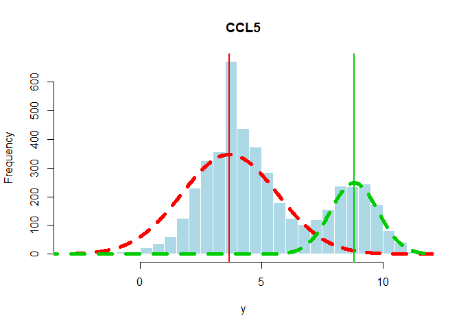
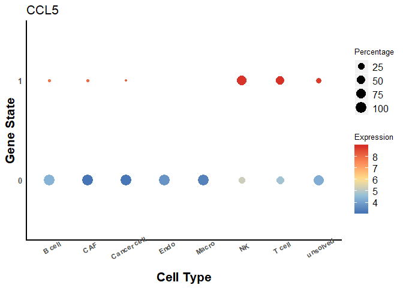
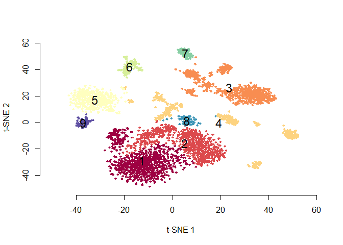

Introduction
------------

A key challenge in modeling single-cell RNA-seq data is to capture the
diversity of gene expression states regulated by different
transcriptional regulatory inputs across individual cells, which is
further complicated by largely observed zero and low expressions. We
developed a left truncated mixture Gaussian (LTMG) model, from the
kinetic relationships of the transcriptional regulatory inputs, mRNA
metabolism and abundance in single cells. LTMG infers the expression
multi-modalities across single cells, meanwhile, the dropouts and low
expressions are treated as left truncated. We demonstrated that LTMG has
significantly better goodness of fitting on an extensive number of
scRNA-seq data, comparing to three other state-of-the-art models. Our
biological assumption of the low non-zero expressions, rationality of
the multimodality setting, and the capability of LTMG in extracting
expression states specific to cell types or functions, are validated on
independent experimental data sets. For more detail please refer and
cite our paper \[Wan, C., Chang, W., Zhang, Y., Shah, F., Lu, X., Zang,
Y., Zhang, A., Cao, S., Fishel, M.L., Ma, Q. and Zhang, C., 2019. LTMG:
a novel statistical modeling of transcriptional expression states in
single-cell RNA-Seq data. Nucleic acids research, 47(18),
pp.e111-e111.\]
(<a href="https://academic.oup.com/nar/article/47/18/e111/5542876" class="uri">https://academic.oup.com/nar/article/47/18/e111/5542876</a>).

Installation
------------

We have received great number of feedbacks since the publish of our
work. Here we provide this update package of LTMG with much convenient
interfaces and command lines.

    #install.packages("devtools")
    #devtools::install_github("clwan/LTMGSCA",force=TRUE)

Process Input
-------------

LTMG fits on normalized gene expression profile along with the
imputation of global Zcut in deriving left truncation. In this section,
we provide necessary functions to get normalized expression (Noted, not
log normalized) and Zcut. We also inhereted the Read10X functions from
[Seurat](https://satijalab.org/seurat/), for the convenience of reading
10X files. Here we illustrate the input process for 10X data
[PBMC](https://www.nature.com/articles/ncomms14049) and normalized data
[Melanoma
dataset](https://science.sciencemag.org/content/352/6282/189.long).

    ### The R packages involved in LTMG package
    library(LTMGSCA)
    library(Matrix)
    library(dplyr)

    ## 
    ## Attaching package: 'dplyr'

    ## The following objects are masked from 'package:stats':
    ## 
    ##     filter, lag

    ## The following objects are masked from 'package:base':
    ## 
    ##     intersect, setdiff, setequal, union

    library(ggplot2)
    library(ggpubr)

    ## Loading required package: magrittr

    library(Rtsne)
    library(RColorBrewer)
    library(KRLS)

    ## ## KRLS Package for Kernel-based Regularized Least Squares.

    ## ## See Hainmueller and Hazlett (2014) for details.

    library(RSpectra)
    library(SwarmSVM)
    library(reshape2)

    ### Read and preprocess 10X files
    #PBMC<-Read10X("PBMC")
    #PBMC_meta<-Data_Meta(PBMC)
    #Plot_Meta(PBMC_meta)

    #PBMC<-Data_subset(PBMC,PBMC_meta,nFeature.lower = 200,nFeature.upper = 2000,Counts.upper = 5000,Percent.mt.upper = 0.1)

    #PBMC<-PBMC[rowSums(PBMC>0)>0.01*ncol(PBMC),]
    #PBMC<-NormalizeCount(PBMC)

    #Zcut_G<-log(Global_Zcut(PBMC))

    ### Read and Proprocess normalized data
    ### Please filter all zero columns and rows first.
    File_data<-as.matrix(read.table("Melanoma.txt",sep = "\t",header = T,row.names = 1))
    File_data<-File_data[rowSums(File_data)>0,colSums(File_data)>0]
    Zcut_G<-log(Global_Zcut(File_data))

Visualize Gene Expression State
-------------------------------

We will use the melanoma dataset to illustrate the functionalities in
the following sections.   The most important functionality of LTMG is
to fit the gene expression with mixture guassian distribution. Such
that, gene expression state can be viewed as the different Guassian
peaks.   Here we fit the CCL5 gene expression in melanoma. As
illustrated in the histgram, CCL5 gene expression is fitted by two
states. One is suppressed expression state (red), which is constited by
low and zero expression. The other one is active expression state
(green) where the expression are with true biological
functionalities. We also retrieved cell annotation from original paper.
In the dot plot, we highlighted the enrichment of different cell type in
different expression states.The color level indicates the mean
expression in the group, the size level indicates the enrichment of
cells in each expression state, respect the cell types.

    ### Fit single gene LTMG
    Gene<-"CCL5"
    VEC<-File_data[Gene,]
    VEC_LTMG<-LTMG(VEC,Zcut_G,k=5)

    ### Visualize the LTMG gene expression distribution
    plot_gene(VEC = VEC,Data_LTMG = VEC_LTMG,Zcut = Zcut_G)

    ### Visualize the cell type distribution on expression state
    load("Melanoma_cell.RData")
    plot_dot(VEC = VEC,Data_LTMG = VEC_LTMG,cell_key = cell_key,Zcut = Zcut_G,Gene=Gene)

Better Low Dimensional Visulization
-----------------------------------

In [LTMG
paper](https://academic.oup.com/nar/article/47/18/e111/5542876), we
proved that LTMG discitized expression state has better low dimensional
visualization by applying t-SNE and UMAP. We highlighted this
functionality here with Melanoma dataset.  TSNE is called by
LTMG\_tsne function. The default dims, perplexity, max\_iter and
partical\_pca are set as 2, 30, 5000 and False, respectively. The
visualization can be ploted by the function plot\_cluster.   
Here we use marker genes retrieved from original paper. Noted, if the
marker genes list is not available, it is sufficiant to use top 1000 or
2000 variant genes. Except for the unresolved cells, LTMG can distinctly
seperate the cell cluster in lower dimensions.

    ### Select top variant genes
    # Gene_use<-rownames(File_data)[order(apply(File_data, 1, var),decreasing = T)[1:2000]]

    load("Melanoma_marker.RData")
    #Gene_use<-intersect(Gene_use,rownames(File_data))
    File_LTMG<-LTMG_MAT(MAT = File_data,Zcut_G = Zcut_G,Gene_use = Gene_use)

    ## Progress:0%
    ## Progress:10%
    ## Progress:20%
    ## Progress:30%
    ## Progress:40%
    ## Progress:50%
    ## Progress:60%
    ## Progress:70%
    ## Progress:80%
    ## Progress:90%
    ## Progress:100%

    File_LTMG<-LTMG_tsne(File_LTMG = File_LTMG)
    File_LTMG$cluster<-cell_key

    Plot_Cluster(File_LTMG,Plot_Legend = T)

Unsupervised Clustering
-----------------------

For the dataset without prior cell type information, we provide a
spectral clustering-based approach in clustering single cell from LTMG
generated low dimensionl projection. Here we use guassian kernel in
calculating distance matrix. And find the number of eigen values less or
equal to 1e-5 as the cluster number.  Noted, the last steps of
spectral clustering is to use Kmeans on eigenvectors corresponding to 0
valued eigen values. Though the spectral clustering works well most of
time, it could be unstable sometimes. User could run the LTMG\_cluster
several time for optimal output. The subsequent call of LTMG\_cluster
will save lots of time, since we will only run the last Kmeans step.

    File_LTMG<-LTMG_Cluster(File_LTMG)

    ## Warning: did not converge in 10 iterations

    Plot_Cluster(File_LTMG,Plot_Label = T)

Analysis of Clusters
--------------------

After we have the unsupervised clustering, next, we will find out the
specific gene expression states for each clusters. Here we use function
LTMG\_Diff. The input is the File\_LTMG list object, the cell labels, as
well as number of the top differentially expressed genes for each
cluster. Plot\_State\_Heatmap function draws the heatmap for
differentially expressed genes.  User can annotate the clusters on
top of the heatmap. Then user could look into specific genes through the
single gene analysis.

    File_LTMG<-LTMG_Diff(File_LTMG,File_LTMG$cluster,TOP = 20)

    Plot_State_Heatmap(File_LTMG)

